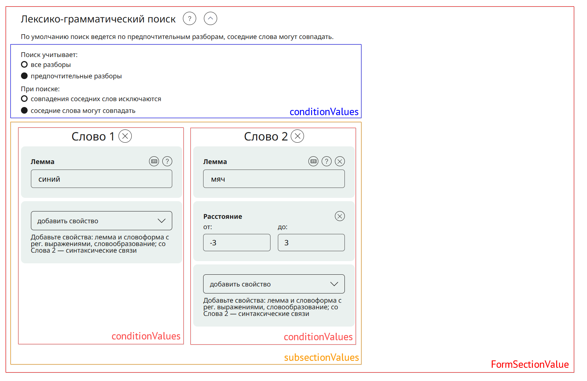

# Лексико-грамматический поиск
С помощью лексико-грамматического поиска можно искать последовательность лексем и/или словоформ, обладающих определенными грамматическими и/или семантическими характеристиками.

## Структура поискового запроса
В [описании](common-format.md#formsectionvalue) структуры запроса упоминалось, что разные формы используют разную схему заполнения `FormSectionValue`.

---

{width=100%}
Рассмотрим заполнение формы с референсом на интерфейс.

### Уровени и блоки
1. **Верхний уровень** — `FormSectionValue` *(красная рамка)*

    Контейнер всей формы

2. **Условия запроса** — `conditionValues` *(синяя рамка)*

    Задают виды **разборов и проверку совпадения соседних слов**. 
    
    Применяются ко всему запросу, а не к отдельным словам.

3. **Список слов** — `subsectionValues` *(оранжевая рамка)*

    Хранит **массив искомых слов**. Каждый элемент массива — **одно слово**, представленное собственным массивом `conditionValues`.

4. **Слово** — `conditionValues` *(розовая рамка)*

    Набор **условий для конкретного слова**. Один массив `conditionValues` = условия **одного** слова.


## Пример
Теперь представим запрос с скриншота выше в виде JSON
```json
{
  "lexGramm":{
    "sectionValues":[ // FormSectionValue
      {
        "conditionValues":[ // условия на весь запрос
          {
            "fieldName":"disambmod", // Предпочтительные разборы
            "text":{
              "v":"main"
            }
          },
          {
            "fieldName":"distmod", // соседние слова могут совпадать
            "text":{
              "v":"with_zeros"
            }
          }
        ],
        "subsectionValues":[
          {
            "conditionValues":[ // условия первого слова
              {
                "fieldName":"lex",
                "text":{
                  "v":"синий"
                }
              }
            ]
          },
          {
            "conditionValues":[ // условия второго слова
              {
                "fieldName":"lex",
                "text":{
                  "v":"мяч"
                }
              },
              {
                "fieldName":"dist",
                "intRange":{
                  "begin":-3,
                  "end":3
                }
              }
            ]
          }
        ]
      }
    ]
  }
}
```
## Дополнительные возможности
С дополнительной информацией по использованию операторов вы можете ознакомиться в [руководстве на сайте](https://ruscorpora.ru/page/manual-lemmasearch-advanced/)